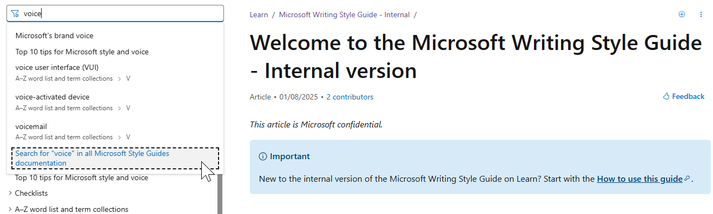

# How to use this guide

This style guide is organized alphabetically in two basic categories: [A-Z names + terms](~\a_z_names_terms\az-names-and-terms.md) and other topics regarding general style as it pertains to Cloud + AI.

The topics found in the A-Z names + terms are listed by their “subsequent mention” form of the name. For example, the topic for the product name _[Microsoft Dynamics 365 Customer Service](~\a_z_names_terms\c\customer-service.md)_ has the title _Customer Service_, and will be found in the C list. Whereas, the topics for product names that (for trademark reasons) must always include Microsoft, Azure, Dynamics 365, or Power (etc.) are titled according to that full, preferred reference. And then they’re listed in the navigation pane in the M, A, D, or P lists, for example. 

## Searching

You can search the table of contents of a specific style guide or search across all Microsoft style guides.

To search the table of contents of a specific style guide, enter a term in the search bar above the table of contents for this guide. This search returns the articles that contain the search term in the title.

To search across all the Microsoft Style Guides (that is, the Product Style Guide as well as the internal and external versions of the Writing Style Guide), enter a term in the search bar above the table of contents for any style guide and select the option **Search for *term* in all Microsoft Style Guides documentation**, which appears at the end of the search results.

For example:

### Using Microsoft Bing

You can also use [Microsoft Bing](https://www.bing.com/) to search the style guides. Make sure to include the terms "Microsoft Style Guide" in your search query. For example:

## Some links require corporate network access

Though the guide is available to external users who've been granted access, some links within the guide require corporate network access.

## Use the supporting resources

1. Consider this Microsoft Product Style Guide as your primary reference.
2. Then use the [Microsoft Writing Style Guide](/writing-style-guide-msft-internal/welcome/) for other matters of style and voice.
3. If you don’t find a term in this style guide or the Microsoft Writing Style Guide, refer to the Merriam Webster Dictionary.

**Tips**: If a term is in the [Merriam-Webster Dictionary](https://www.merriam-webster.com/), it's not duplicated here.

And if the Merrian-Webster Dictionary gives two spellings for a word—like acknowledgment and acknowledgement—use the first spelling listed.

## Additional help with grammar and usage

Check out [Other Microsoft style references](~\welcome\other-microsoft-style-references.md) for links to other recommended writing resources.

**Important**: For questions of style, product names, capping, terminology, or proper usage, never rely on a Figma file, production code, Microsoft website, product UI, documentation, or localization resources in place of this guide.

