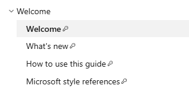
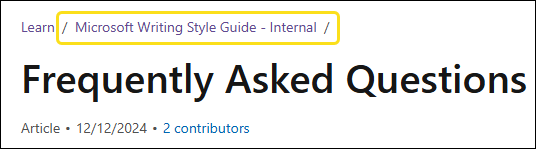
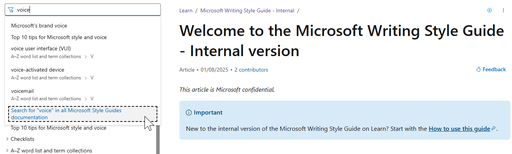
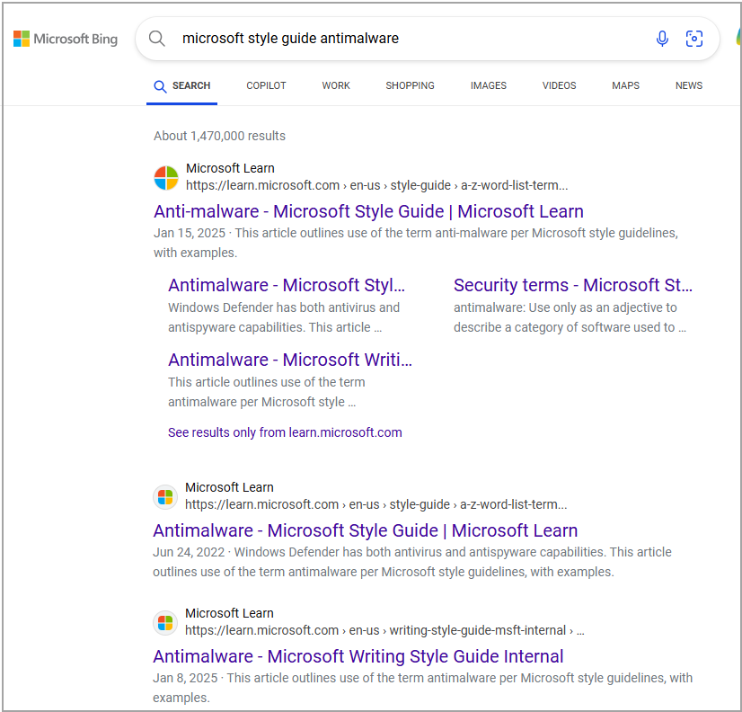

# Frequently Asked Questions

*This article is Microsoft confidential.*

## What's the difference between the internal and external versions of the Microsoft Writing Style Guide?

The internal version of the Microsoft Writing Style Guide includes additional guidelines and resources that are specific to Microsoft employees. The external version of the Microsoft Writing Style Guide is publicly accessible and focuses on general writing principles and terminology that can be used by anyone.

## What's permissioned content?

Permissioned content is information that can only be accessed by users or groups who have been granted the necessary permissions to view it.

The Microsoft Writing Style Guide is available in two versions: an internal version for Microsoft employees and an external version for the general public. Previously, the internal guide was hosted on a separate platform (styleguides.azurewebsites.net). It has been migrated to Microsoft Learn, which uses permissioned content functionality, which ensures that sections intended for internal use only are accessible exclusively to authorized users.

To access internal-only content, users must sign in with an authorized Microsoft Learn profile. Access is limited to Microsoft (FTE, v-, and a-).
Articles that contain confidential content are marked with a key icon in the table of contents. For example:

Additionally, Microsoft-only content is clearly labeled within articles, making it easy for you to find internal resources:

- **Internal-only articles** are identified with the statement *This article is Microsoft confidential* at the top. Here's an example: [Microsoft Editorial Board](~/welcome/microsoft-editorial-board.md)
- **Articles with additional internal-only instructions** include a section titled **Guidelines for Microsoft authors** at the bottom. Here's an example: [illegal](~/a-z-word-list-term-collections/i/illegal.md)

## Are the URLs different for the internal and external version of the style guides?

Yes. While most of the content is shared between the two versions, there are two different URLs you should use to access the style guides:

- **External Style Guide**: The URL remains unchanged. You can access it at [https://learn.microsoft.com/style-guide/welcome/](/style-guide/welcome/). This version is intended for the general public and has not been altered.
- **Internal Style Guide**: The URL for the internal version is [https://learn.microsoft.com/writing-style-guide-msft-internal/welcome/](/writing-style-guide-msft-internal/welcome/). This version is designed for Microsoft internal use.

## I thought I was navigating the internal version of the style guide, but now I'm in the external version. What happened?

The internal version of the Microsoft Writing Style Guide features a contextual table of contents (TOC), which helps maintain your place within the internal guide while browsing through articles. However, some articles are shared between the internal and external versions, with the external guide serving as the primary source for shared content. In the internal TOC, links without a key icon point to these shared articles.

If you select a link within an article that is part of the external style guide, it may direct you to the external version, causing confusion. This is a limitation of the Learn platform. Here are a few tips to help you navigate back to the internal style guide:

- **Bookmark the internal guide**: Save the URL for the internal style guide ([https://learn.microsoft.com/writing-style-guide-msft-internal/welcome/](/writing-style-guide-msft-internal/welcome/)) to easily return to the internal version.
- **Use the browser's back button:** If you find yourself in the external guide, simply use the back button to return to the internal style guide.

You can easily see if you're in the internal version by looking at the breadcrumb:

By following these steps, you can minimize confusion and ensure you're accessing the correct version of the style guide.

## I would like to update something in a style guide. Who should I work with to do this?
For the Microsoft Product Style Guide, please see this page for information on how to update a topic: [Suggest a topic or ask a question](/product-style-guide-msft-internal/welcome/suggest-a-topic-or-ask-a-question)
For the Microsoft Writing Style Guide, please reach out to your group's [Microsoft Editorial Board](~/welcome/microsoft-editorial-board.md) member or email [msstyle@microsoft.com](mailto:msstyle@microsoft.com).

## How do I provide feedback on the Microsoft Writing Style Guide?

To request additions or revisions to the Microsoft Writing Style Guide, reach out to your group's [Microsoft Editorial Board](~/welcome/microsoft-editorial-board.md) member or email [msstyle@microsoft.com](mailto:msstyle@microsoft.com).

## How can I search the style guides?

You can search the table of contents of a specific style guide or search across all Microsoft style guides.

To search the table of contents of a specific style guide, enter a term in the search bar above the table of contents for this guide. This search returns the articles that contain the search term in the title.

To search across all the Microsoft Style Guides (that is, the Product Style Guide as well as the internal and external versions of the Writing Style Guide), enter a term in the search bar above the table of contents for any style guide and select the option **Search for *term* in all Microsoft Style Guides documentation**, which appears at the end of the search results.

For example:

### Using Microsoft Bing

You can also use [Microsoft Bing](https://www.bing.com/) to search the style guides. Make sure to include the terms "Microsoft Style Guide" in your search query. For example:

